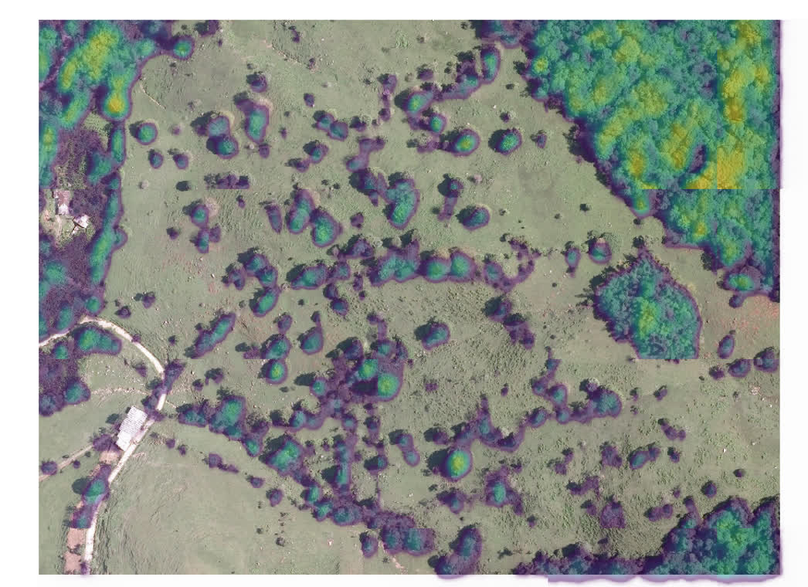
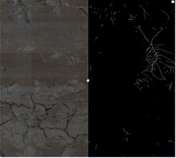
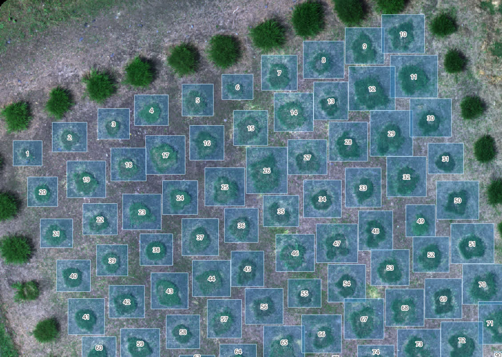
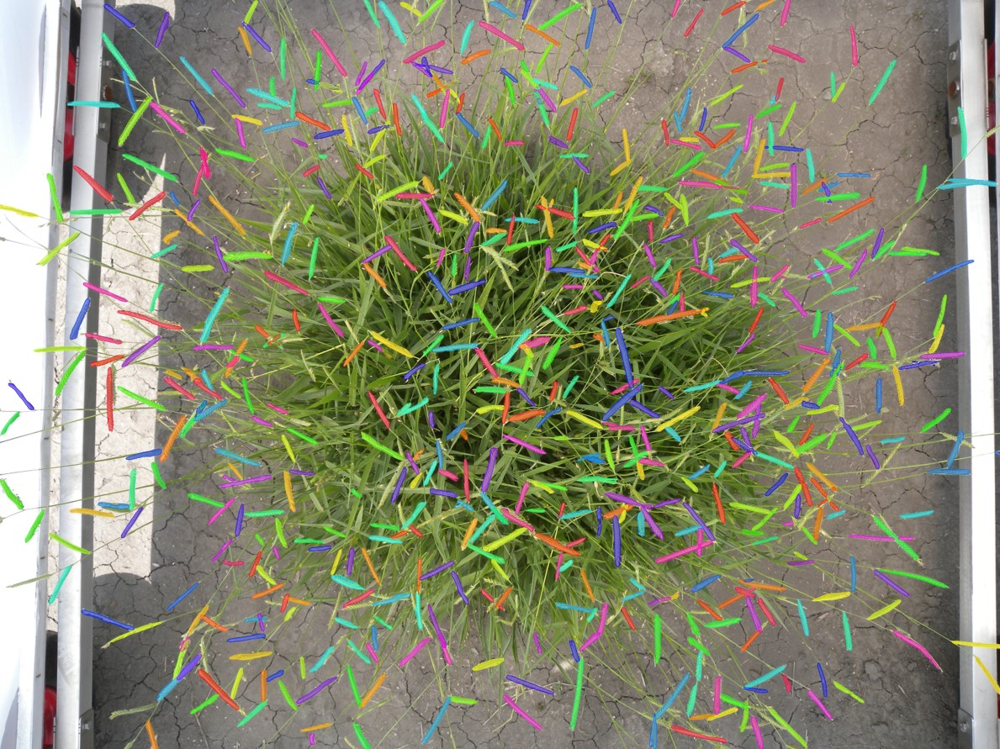
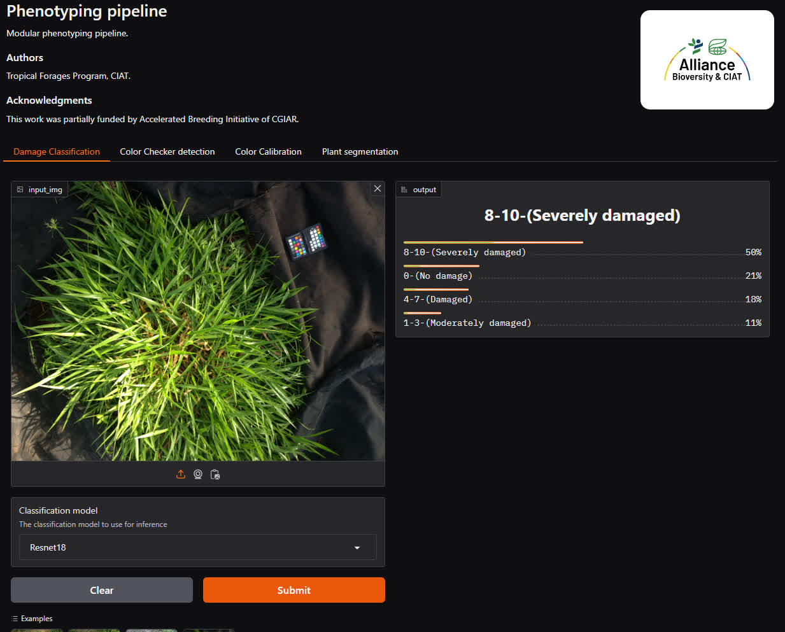
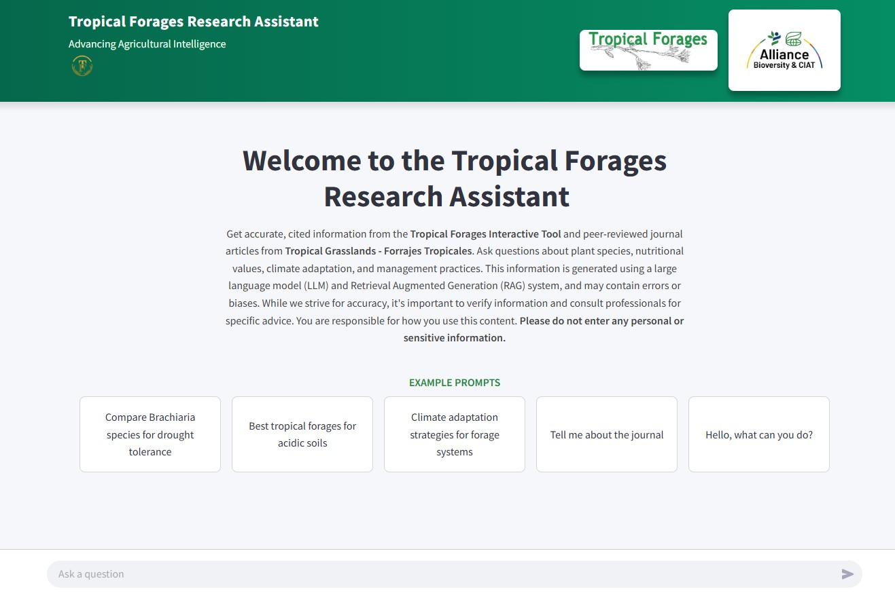
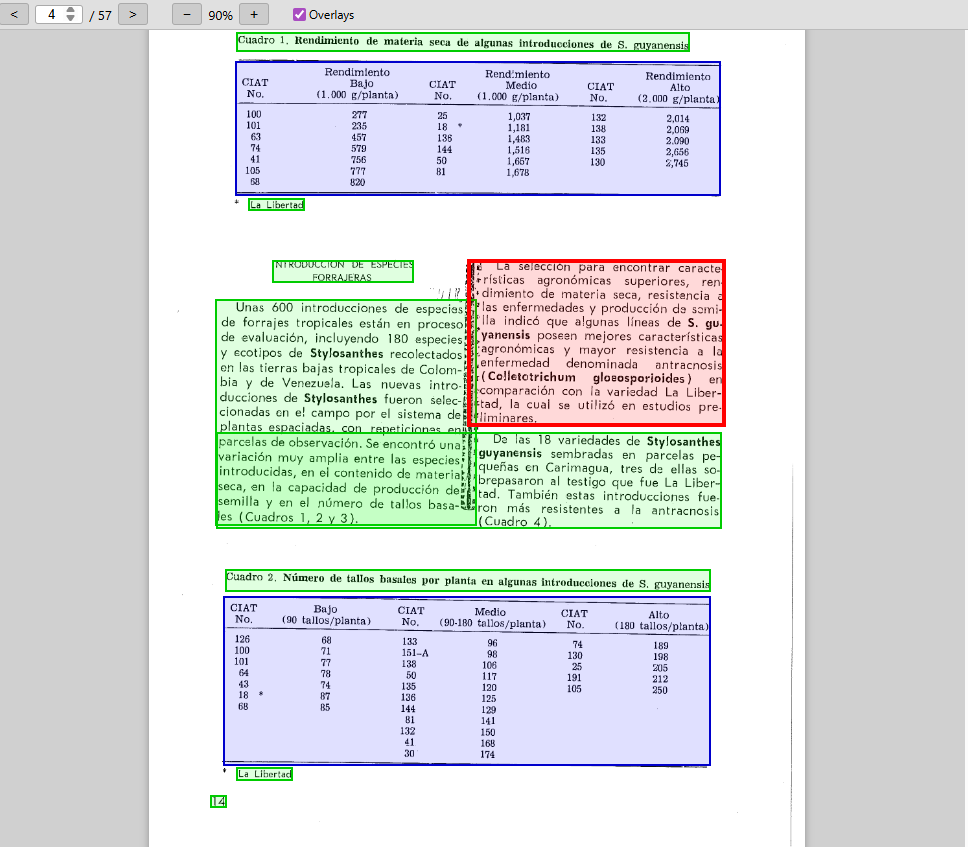
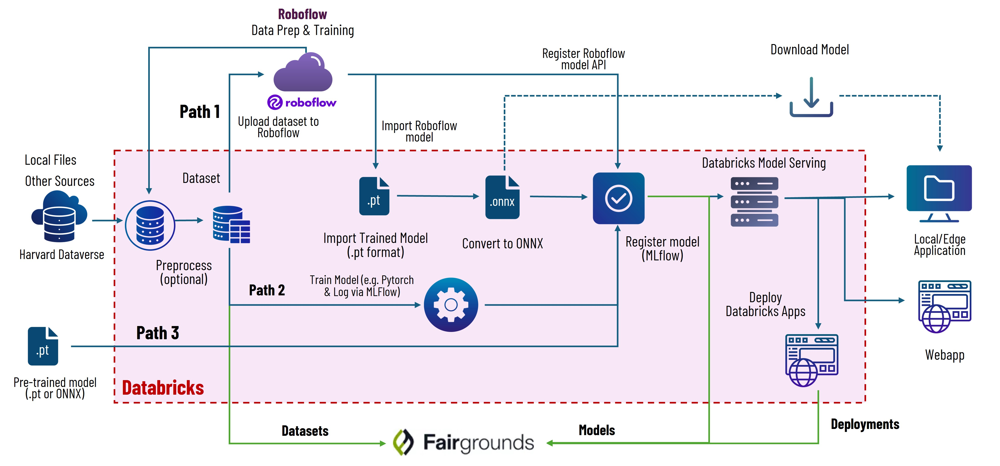

# Tropical Forages AI Guidelines

A curated collection of resources, datasets, models, and tools to support machine learning, deep learning, and AI workflows in the Tropical Forages Program.

---

## Table of Contents
- [Overview](#overview)
- [Datasets](#datasets)
- [Pretrained Models](#pretrained-models)
- [Labeling Tools](#labeling-tools)
- [Image Processing Tools](#image-processing-tools)
- [Pipelines & Workflows](#pipelines--workflows)
- [Best Practices & Guidelines](#best-practices--guidelines)
<!-- - [Contributing](#contributing)
- [Support](#support)
- [License](#license) -->

---

## Overview
This repository is designed to help both newcomers and advanced users understand and contribute to the AI, ML, and DL efforts of the Tropical Forages Program. Here you will find links to datasets, models, tools, and documentation relevant to our workflows and MLOps.

## Datasets
A list of useful datasets for tropical forages research. 

| Name | Description |
|------|-------------|
| [Dataset: Forage grasses in crop fields from ultra-high spatial resolution UAV-based imagery](https://dataverse.harvard.edu/dataset.xhtml?persistentId=doi:10.7910/DVN/DBGUFW) | UAV-based imagery of forage fields |
| [Tolerance to spittlebugs (Hemiptera: Cercopidae) in Urochloa spp. and Megathyrsus maximus grasses](https://dataverse.harvard.edu/dataset.xhtml?persistentId=doi:10.7910/DVN/EGUVHA) | Damage classification |
| [Top view RGB image dataset of Urochloa hybrids for HTP and AI applications](https://dataverse.harvard.edu/dataset.xhtml?persistentId=doi:10.7910/DVN/U0KL6Y) | Raceme instance segmentation in forage plants |
| [RGB Image Dataset of Urochloa Hybrids for High-Throughput Phenotyping and Artificial Intelligence Applications](https://dataverse.harvard.edu/dataset.xhtml?persistentId=doi:10.7910/DVN/X4LM19) | Raceme instance segmentation in forage plants extended |

## Models

### 3rd Party pre-trained models

* [HighResCanopyHeight](https://github.com/facebookresearch/HighResCanopyHeight)
* [DeepForest](https://github.com/weecology/DeepForest)
* [SegRoot](https://github.com/wtwtwt0330/SegRoot)

--
* [Canopy Height Maps v2 (CHMv2)](https://huggingface.co/facebook/dinov3-vitl16-chmv2-dpt-head)

<!-- ### Pre-trained Models -->

<!-- | Model Name          | Task                        | Description                  |
|---------------------|-----------------------------|------------------------------|
| ForageNet-v1        | Species classification      | CNN trained on field images  | 
| BiomassEstimator    | Biomass estimation          | Regression model             | -->

<!-- ### Fine-tuned Models -->

### Foundation Models

- [SAM - Segment Anything Model](https://segment-anything.com/)
- [SAM2]()
- [DINOv2](https://github.com/facebookresearch/dinov2)
- [DINOv3](https://github.com/facebookresearch/dinov3)

### Embeddings
- [AlphaEarth Embeddings](https://developers.google.com/earth-engine/datasets/catalog/GOOGLE_SATELLITE_EMBEDDING_V1_ANNUAL?utm_source=deepmind.google&utm_medium=referral&utm_campaign=gdm&utm_content)

# Deployments / Tools

| Name | Description | Image |
|------|-------------|-------|
| [TreeEyed: QGIS plugin for tree monitoring](https://github.com/afruizh/treeeyed) | QGIS plugin to leverage AI models for tree monitoring using remote sensing imagery |  |
| [RootingAI](https://github.com/afruizh/root_analysis ) | Root segmentation for underground root scanners |  |
| [ForagesROIs](https://github.com/afruizh/forages_rois ) | Forage grass detection in crop fields |  |
| [BrRacemecounter](https://github.com/darwin-arrechea-castillo/Mask_RCNN-Raceme_Instance_Segmentation) | Raceme detection and counting |  |
| [GrassDamageAI](https://github.com/afruizh/damage_assessment_pipeline) | Damage classification and quantification  |  |
| [Forages Chatbot](https://github.com/afruizh/forages_chatbot_streamlit) | RAG Agent tropical forages research assistant chatbot |  |
| [Document OCR Utility](https://github.com/afruizh/document_ocr_utility) | Utility to apply document OCR |  |

# MLOps

## Computer Vision Platforms & Services

- [Ultralytics](https://www.ultralytics.com/)
- [Roboflow](https://roboflow.com/)
- [LandingLens](https://landing.ai/landinglens)
- [HugginFace](https://huggingface.co/)
- [Databricks](https://www.databricks.com/)

## MLOps Strategy

### Hugging Face

- [Hugging Face Spaces](https://huggingface.co/spaces) : Test state of the art models

#### Tips

* Host models
* Useful python Transformers library to 
* To download some models it's required
* Set up `HF_HOME` to change default location of downloaded models (legacy use `TRANSFORMERS_CACHE`)
* Use **Huggin Spaces** to deploy webapp prototypes

## Labeling Tools
Recommended tools for data annotation, cleaning, and preprocessing.

- [CVAT](https://www.cvat.ai/)
- [LabelImg](https://github.com/tzutalin/labelImg): Image annotation tool for object detection datasets.
- [Roboflow](https://roboflow.com/)
- [Datumaro](https://github.com/open-edge-platform/datumaro): python library for computer vision dataset manipulation (CVAT uses datumaro)

## Documents OCR
- [Landing AI - Agentic Document Extraction (ADE)](https://github.com/landing-ai/ade-python)
- [Docling](https://www.docling.ai/) / [Visual Grounding](https://docling-project.github.io/docling/examples/visual_grounding/)

## Speech to text transcription

- [Whisper](https://github.com/openai/whisper)

## Large Language Models (LLM)
- [LangChain](https://www.langchain.com/)
- [Model Context Protocol (MCP)](https://modelcontextprotocol.io/docs/getting-started/intro)
- [Agent2Agent (A2A) Protocol](https://a2a-protocol.org/latest/)

-- 
- Agentic RAG System

### Auto labeling

- Grounding DINO
- YOLOE model
- SAM (Segment Anything Model)

## Computer Vision Platforms & Services

## Image Processing Tools

- [QGIS](https://qgis.org/): Open-source GIS for spatial data processing.
- [Pliman](https://tiagoolivoto.github.io/pliman/)
- [PlantCV](https://plantcv.readthedocs.io/en/stable/)
- [ImageJ](https://imagej.net/ij/)
/ [FIJI](https://imagej.net/software/fiji/)

## Integrated development environment (IDE)

- [VSCode](https://code.visualstudio.com/) / [Github Copilot Plugin](https://code.visualstudio.com/docs/copilot/overview)
- [Antigravity](https://antigravity.google/)
- [Cursor](https://cursor.com/)
- [Windsurf](https://windsurf.com/editor)
- [Gemini CLI](https://geminicli.com/)
- [Claude Code](https://claude.com/product/claude-code)

## Pipelines & Workflows
Guides and scripts for common ML/DL workflows in the program.

- Data ingestion and cleaning
- Model training and evaluation
- Deployment and inference

<!-- ## Best Practices & Guidelines
Documentation and tips for reproducible research, data management, and collaboration.

- How to structure a dataset
- Version control for data and models
- Documentation standards -->

## Additional Resources
- [Quantitative Plant](https://quantitative-plant.org/): repository of datasets, models and tools for plant analysis.
- [Global Pasture Watch](https://github.com/wri/global-pasture-watch): repository of datasets and training for grasslands.

## Data

- [NASA POWER](https://power.larc.nasa.gov/data-access-viewer/): climate data
- [MapBiomas]()
- [Adagia](https://adagiatest.alliance.cgiar.org/): climate data for CIAT campus (tree inventory)

# Deployment

- [Streamlit](https://streamlit.io/)
- [Gradio](https://www.gradio.app/)
- [Google Earth Engine Apps](https://www.earthengine.app/)
- [ShinyApps](https://www.shinyapps.io/)

### Interesting AI challenges

- [AI for Earth Observation](https://ai4eo.eu/)

<!--## Contributing
We welcome contributions! Please see [CONTRIBUTING.md](CONTRIBUTING.md) for guidelines on how to add new resources or suggest improvements.
-->

<!-- ## Support
For questions or support, open an issue or contact the maintainers at [email@example.com](mailto:email@example.com). -->

<!-- ## License
Specify your license here (e.g., MIT, Apache 2.0, etc.).

--- -->

## Authors

Tropical Forages Progam

Alliance Bioversity International & CIAT